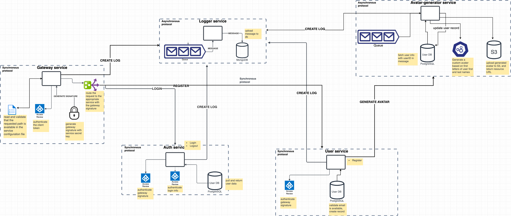

## BASIC MICROSERVICE PROJECT IN GO

This project is a basic blog application backend, my attempt at implementing a microservice application with different communication protocols

### Here's the proposed architecture 


[link](https://drive.google.com/file/d/1xaSWEzuC7NARDynK8X6u38MIRKt9ptMt/view?usp=sharing)


### SERVICES
- [Auth (REST)](#AUTH)
- [User (REST)](#USER)
- [Gateway (REST)](#GATEWAY)
- [Logger (Message Queue)](#LOGGER)
- [Avater generator (Message Queue)](#AVATER-GENERATOR)
- [Notification (Pub-Sub)](#NOTIFICATION)
- [Data Retriever (GraphQL)](#DATA_RETRIEVER)
- [Blog (REST)](#REST)


## AUTH
1. Login
  - verify user info
  - return jwt token
2. Forgot Password
  - send verification OTP to mail
  - validate otp and update password

## USER
1. Signup
  - connects to database (sql)
  - verify user email
  - store user information
  - send user id to avater-generator service queue

## GATEWAY
1. Validate client jwt
2. Routes request to appropriate service
  
## AVATER-GENERATOR
1. Generate a custom avater based on first letters of user first and last names.
2. Upload generated avater to AWS S3
3. Update user record with avater url

## LOGGER
1. save logs to datebase (mongo)

## NOTIFICATION
1. Push Notification
2. Email
3. SMS

## DATA_RETRIEVER
1. Handles the query of all data with GraphQL

## BLOG
1. CRUD ops on blog posts
2. CRUD ops on blog comments
3. Clap blog post

# NOTE
To run the gateway locally, update the base urls of the services in the [conf.yml](https://github.com/ShowBaba/microservice-sample-go/blob/main/gateway-service/conf.yaml) file e.g http://auth-service -> http://localhost

# USAGE

run 
```shell
docker-compose build && docker-compose up
```